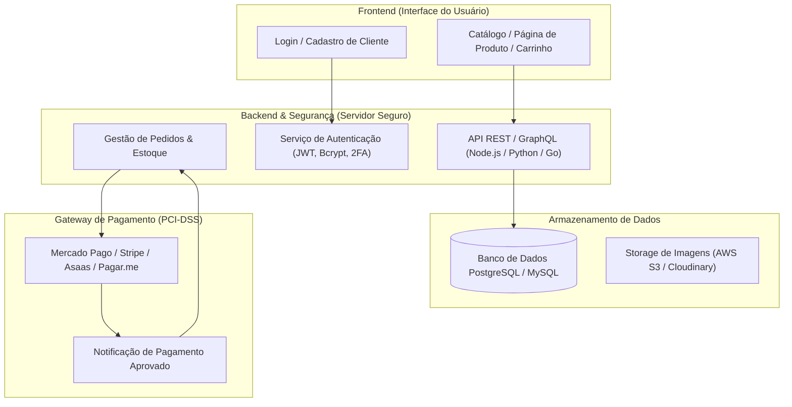

# Plano de Evolução e Implementação — TRIFFEN Streetwear

Este documento estabelece o plano técnico e arquitetural para transformar a presença digital da **Triffen** em uma experiência de e-commerce de alto padrão inspirada na **Rexpeita**, integrando galeria de fotos em alta resolução, efeito de **zoom com lupa (hover magnifying lens)**, seletor de tamanho, cálculo de frete e checkout inteligente via WhatsApp, além de fornecer o direcionamento estratégico para o futuro e-commerce completo (banco de dados, segurança anti-hacking e LGPD).

---

## 1. Visão Geral da Arquitetura & Análise do Projeto Atual

### 1.1 Diagnóstico do Código Atual
- **`index.html`**: Estrutura limpa e moderna com hero banner, manifesto, grid de 3 produtos e seção sobre a marca. Atualmente, os cards apontam direto para links genéricos de WhatsApp sem passar por página individual.
- **`style.css`**: Boa base visual com variáveis CSS para Dark/Light mode, tipografia sólida (`Oswald` + `Inter`) e layout responsivo.
- **`script.js`**: Apenas 13 linhas alternando a classe de tema sem persistência em `localStorage`.
- **Assets**: Já existem fotos de frente, costas e modelos para os 3 modelos (*Bege*, *Marrom* e *Roxa*), prontas para alimentar uma galeria rica.

### 1.2 Objetivo da Nova Versão (Fase Atual: E-commerce Híbrido de Alta Conversão)
1. **Página de Produto Dedicada (`produto.html`)**: Layout 2 colunas inspirado na Rexpeita (Galeria de imagens à esquerda + Painel de decisão/compra à direita).
2. **Hover Zoom / Efeito Lupa**: Lente de aproximação fluida no desktop para examinar corte, costura e detalhes da malha, além de visualização touch/lightbox no mobile.
3. **Catálogo Dinâmico em JS (`products.js`)**: Base de dados local com metadados dos produtos (títulos, preços, fotos, descrições, tabelas de medidas, estoque de tamanhos), permitindo que uma única página `produto.html?id=bege` sirva qualquer produto atual ou futuro.
4. **Checkout Inteligente WhatsApp**: O cliente seleciona o tamanho (ex: `G`) e clica em Comprar; a mensagem no WhatsApp já abre com o nome da peça, tamanho escolhido e valor exato.
5. **Persistência de Tema**: O tema (Dark/Light) escolhido pelo usuário é salvo no navegador (`localStorage`) e mantido ao navegar entre a Home e a Página de Produto.
6. **Simulador de Frete e Tabela de Medidas**: Elementos visuais interativos que aumentam a confiança do consumidor.

---

## 2. Consultoria Especialista: Do WhatsApp ao E-commerce Completo

Como Engenheiro de Software especialista, apresento abaixo o roadmap e os pilares de segurança que você precisa conhecer para o futuro da Triffen:

### 2.1 Como funciona um E-commerce Completo (Arquitetura)

### 2.2 Plataformas Prontas vs. Sistema Próprio (Onde investir?)

1. **Opção A — Plataformas SaaS de E-commerce (Recomendado para início e escala média)**:
   - **Exemplos**: Nuvemshop, Shopify, Loja Integrada, Yampi.
   - **Vantagens**: Segurança, servidor, banco de dados, emissão de nota fiscal, cálculo de Correios/Melhor Envio e antifraude já vêm prontos e certificados. Você não precisa programar o backend nem se preocupar com servidores caindo ou invasões.
   - **Custo**: Mensalidade + pequena taxa por venda.
2. **Opção B — Desenvolvimento Customizado (Full-Stack Próprio)**:
   - **Tecnologias**: Next.js / React no frontend, Node.js / NestJS no backend, PostgreSQL no banco de dados.
   - **Quando usar**: Quando a Triffen atingir milhares de pedidos/dia e precisar de regras de negócio 100% exclusivas.
   - **Atenção**: Exige manutenção constante de infraestrutura, backups e auditorias de segurança.

---

### 2.3 Segurança da Informação, Anti-Hacking e LGPD

Para evitar vazamento de dados e proteger os clientes da Triffen:

> [!IMPORTANT]
> **Regra de Ouro dos Pagamentos (PCI-DSS Compliance)**:
> NUNCA processe ou salve dados de cartão de crédito no seu próprio servidor ou banco de dados. Os e-commerces modernos utilizam **Tokenização de Gateways** (como Mercado Pago, Stripe ou Pagar.me). O cliente digita o cartão em um campo criptografado do gateway e seu site só recebe um "token" temporário. Se o seu servidor for invadido, não há dados bancários para serem roubados!

1. **Prevenção contra Vazamentos e Invasões**:
   - **Senhas Criptografadas**: Nunca salvar senhas em texto puro. Utilizar algoritmos modernos de hash como `Argon2id` ou `Bcrypt` com salt.
   - **Proteção contra SQL Injection**: Uso obrigatório de ORMs/Prepared Statements (ex: Prisma, TypeORM).
   - **Proteção contra XSS (Cross-Site Scripting)**: Sanitização de todas as entradas do usuário no frontend e backend.
   - **HTTPS / SSL Obrigatório**: Criptografia de ponta a ponta (TLS 1.3) para que nenhum dado seja interceptado entre o navegador e o servidor.
   - **Cloudflare / WAF**: Proteção contra ataques DDoS, bots maliciosos e força bruta em formulários de login.
2. **Conformidade com a LGPD (Lei Geral de Proteção de Dados)**:
   - **Política de Privacidade & Termos de Uso** claros e acessíveis no rodapé.
   - **Banner de Consentimento de Cookies** (armazenar apenas o essencial até consentimento).
   - **Minimização de Dados**: Coletar apenas dados estritamente necessários para emissão de nota e entrega (Nome, CPF, E-mail, Endereço e Telefone).
   - **Direito do Titular**: Permitir que o usuário solicite a exclusão de sua conta e anonimização de dados quando desejar.

---

## 3. Mudanças Propostas no Código

### 3.1 Componentes a serem desenvolvidos / modificados

#### [MODIFY] [`index.html`](file:///c:/Users/Gabriel%20Carvalho/Documents/Briel/Freelas/Triffen/triffenlab/index.html)
- Adicionar barra superior de aviso ("🚚 FRETE GRÁTIS EM COMPRAS ACIMA DE R$ 299").
- Atualizar os cards de produtos para terem links apontando para a página de produto individual:
  - `produto.html?id=bege`
  - `produto.html?id=marrom`
  - `produto.html?id=roxa`
- Ajustar semântica e acessibilidade.

#### [NEW] [`produto.html`](file:///c:/Users/Gabriel%20Carvalho/Documents/Briel/Freelas/Triffen/triffenlab/produto.html)
- Nova página com a experiência idêntica à referência da **Rexpeita**:
  - **Topo**: Barra de frete grátis + Navbar com logo, navegação de categorias, alternador de tema e ícone de carrinho/sacola.
  - **Breadcrumbs**: Navegação em trilha (`INÍCIO > DROP I > T-SHIRT OVERSIZED BEGE`).
  - **Coluna Esquerda (Galeria de Imagens)**:
    - Imagem principal em destaque com **Lupa / Zoom no Hover** (acompanha o cursor e amplia a textura da malha em tempo real).
    - Grade/miniaturas de todas as fotos da peça (frente, costas, modelo masculino, modelo feminino).
    - Clique na miniatura troca a foto principal suavemente.
  - **Coluna Direita (Painel de Compra)**:
    - Badge da coleção (`DROP I / ESSENTIALS`).
    - Nome do produto e Preço em destaque com parcelamento ("até 3x sem juros").
    - **Seletor de Tamanhos interativo** (`P`, `M`, `G`, `GG`, `XGG`) com indicação visual de seleção.
    - Modal / Botão com **Tabela de Medidas**.
    - **Botão de Ação Primária ("COMPRAR AGORA")**: Redireciona para o WhatsApp com mensagem formatada incluindo o produto e tamanho selecionado.
    - **Calculadora de Frete (Simulador de CEP)**: Campo interativo com feedback de prazos (SEDEX, PAC, Frete Grátis).
    - **Acordeons informativos**:
      - Descrição e conceito da peça.
      - Detalhes técnicos (Composição 100% algodão, gramatura heavyweight, gola ribana 3cm, etc.).
      - Cuidados com a peça e Guia de Lavagem.
      - Prazos de Envio e Política de Troca.
  - **Botão Flutuante do WhatsApp**: Acesso rápido ao atendimento.

#### [NEW] [`products.js`](file:///c:/Users/Gabriel%20Carvalho/Documents/Briel/Freelas/Triffen/triffenlab/products.js)
- Estrutura JSON/Array com todos os dados dos 3 modelos (Bege, Marrom, Roxa), incluindo caminhos das imagens, descrições, especificações, tabela de medidas e preço.
- Facilidade máxima para adicionar novos drops e produtos no futuro sem precisar escrever novo código HTML.

#### [MODIFY] [`script.js`](file:///c:/Users/Gabriel%20Carvalho/Documents/Briel/Freelas/Triffen/triffenlab/script.js)
- Gerenciamento de tema Dark/Light com suporte a `localStorage` (mantém o tema salvo entre páginas).
- Inicializador da página de produto:
  - Leitura do parâmetro da URL (`?id=...`).
  - Renderização dinâmica dos dados do produto.
  - Motor da **Lupa de Zoom** (cálculo de coordenadas X/Y do mouse e ampliação matemática com suavização).
  - Controle de seleção de tamanhos e atualização dinâmica do link do WhatsApp.
  - Comportamento de acordeons retráteis e simulador de CEP.

#### [MODIFY] [`style.css`](file:///c:/Users/Gabriel%20Carvalho/Documents/Briel/Freelas/Triffen/triffenlab/style.css)
- Estilos para a barra de aviso superior (Top Bar).
- Estilos da página de produto (Grid de 2 colunas, Sticky lateral, Miniaturas, Lupa de Zoom, Botões de tamanho, Acordeons).
- Estilos da Tabela de Medidas (Modal).
- Responsividade completa para smartphones, tablets e telas ultrawide.

---

## 4. Plano de Verificação

### 4.1 Testes Manuais de Interface e Interatividade
- **Navegação**: Clicar nos cards da Home e verificar se cada um abre o respectivo produto com fotos corretas.
- **Efeito Lupa (Hover Zoom)**:
  - Passar o mouse sobre a imagem principal no desktop e verificar se a área ampliada foca na posição exata do cursor.
  - Trocar de miniatura e testar se o zoom passa a refletir a nova imagem ativa.
- **Seletor de Tamanho & WhatsApp**:
  - Selecionar tamanhos diferentes (`P`, `M`, `G`, `GG`, `XGG`) e verificar se o botão atualiza o texto e gera a URL correta do WhatsApp com a mensagem personalizada.
- **Simulador de Frete**: Digitar CEP e clicar em Calcular para verificar o feedback visual de opções de envio.
- **Persistência de Tema**: Alternar tema para claro ou escuro na Home, navegar para a página de produto e confirmar que o tema se mantém sem piscar a tela.
- **Responsividade**: Testar visualização em viewport mobile (375px), tablet (768px) e desktop (1440px).

---

## 5. Próximos Passos
Após a sua aprovação deste plano, iniciaremos a implementação imediata dos arquivos com código limpo, semântico, performático e visual refinado.
